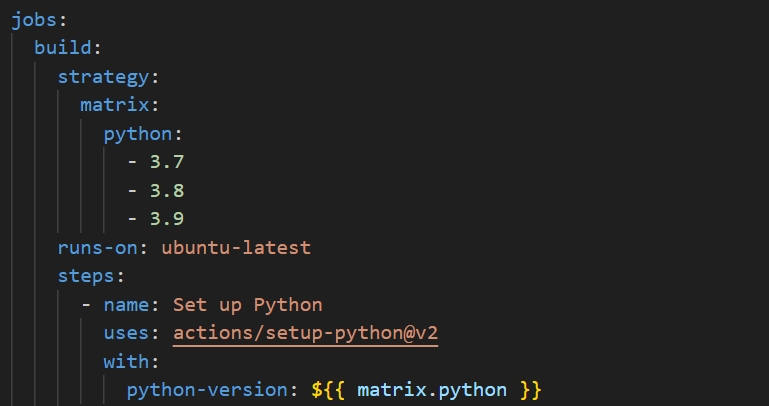
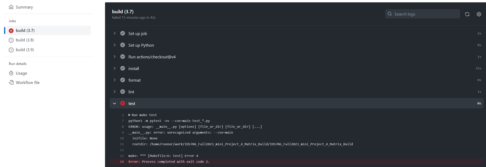
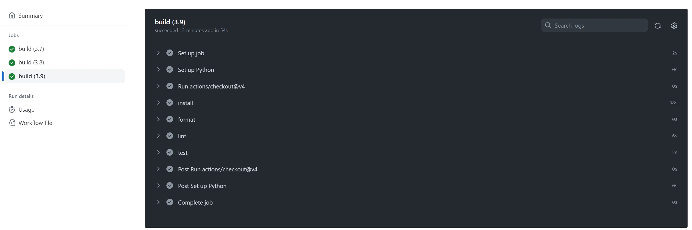

# IDS706_Fall2023_mini_Project_4_Matrix_Build

IDS706 Fall2023 Mini Project 4: GitHub Actions Matrix Build for Multiple Python Versions

It contains:

- ``.devcontainer`` includes a `Dockerfile` that specifies the configurations of container, and a `devcontainer.json` which is a configuration file used in the context of Visual Studio Code

- ``workflows`` includes `GitHub Actions`, enables automated build, test and deployment for the project. **Specifically for this project, the matrix strategy is included to build and test across multiple Python versions**

- ``Makefile`` specifies build automation on Linux

- ``requirements.txt`` lists the dependencies, libraries, and specific versions of Python packages required for the project

It also includes ``main.py`` and ``test_main.py`` as sample files including basic usecase of ``pandas`` to show the functionality of the CI pipeline.

## Github Actions Demo For Matrix Build
In this project, the `github-actions.yml` contains matrix strategy to build and test the code across multiple Python versions, as shown below:

For example, the original ``Makefile`` does not pass the build pipeline of ``Python 3.7``, which indicates an error in the workflow:

Fix that, commit and re-run the workflow, it passes - showing the current code is compatible with Python version ``3.7``, ``3.8`` and ``3.9``
